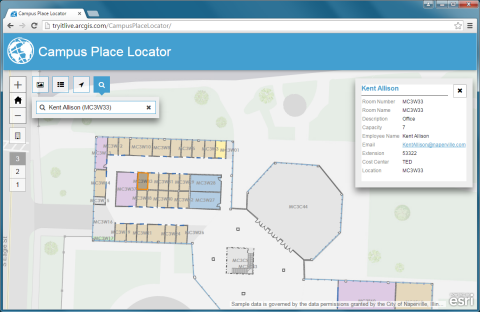

# campus-place-locator

***The Campus Place Locator is a replacement to the [Campus Place Finder application](https://github.com/Esri/campus-place-finder)***

Campus Place Locator is a configuration of ArcGIS and a JavaScript application that offers a map-based view of interior and exterior assets on a university or business campus.

* Try the [Campus Place Locator application](http://links.esri.com/localgovernment/tryit/CampusPlaceLocator/)

## Features

* Search for an employee by name, or building space
* Use the map and floor navigator to find an area of interest.

## Requirements

**Start now using Esri-supplied sample services**

You can start using the application now by setting it up on a web server running Microsoft Internet Information Services (IIS) and using sample services supplied by Esri.
You'll need to convert to an application in IIS and use the ASP .NET 4.0 or 4.5. application pool.

**Start now using your own services**

For more information on requirements and publication steps, see [Campus Place Locator Government](http://links.esri.com/localgovernment/help/campusplacelocator) help

## Resources

Show me a list of other [Local Government GitHub repositories](http://esri.github.io/#Local-Government).

Additional [information and sample data](http://links.esri.com/localgovernment/help/campusplacelocato)
are available for the application.

This application uses the 3.14 version of
[Esri's ArcGIS API for JavaScript](http://help.arcgis.com/en/webapi/javascript/arcgis/);
see the site for concepts, samples, and a reference for using the API to create mapping web sites.

## Issues

Find a bug or want to request a new feature?  Please let us know by submitting an issue.

## Contributing

Esri welcomes contributions from anyone and everyone.
Please see our [guidelines for contributing](https://github.com/esri/contributing).

## Attribution

## Licensing

Copyright 2013 Esri

Licensed under the Apache License, Version 2.0 (the "License");
you may not use this file except in compliance with the License.
You may obtain a copy of the License at

   http://www.apache.org/licenses/LICENSE-2.0

Unless required by applicable law or agreed to in writing, software
distributed under the License is distributed on an "AS IS" BASIS,
WITHOUT WARRANTIES OR CONDITIONS OF ANY KIND, either express or implied.
See the License for the specific language governing permissions and
limitations under the License.

A copy of the license is available in the repository's
[LICENSE.txt](https://raw.github.com/Esri/configurable-place-finder/master/LICENSE.txt) file.

